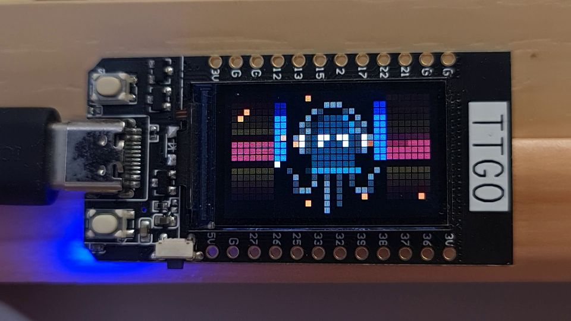

# TTGO T-Display screen as output

Use the lilygo/ttgo t-displays screen as a matrix output.

<small>Click to video:</small>
[](https://youtu.be/giMm4g4p5ZQ)

### Build

Use the following environment in platformio.ini or in platformio_override.ini:

```ini
[platformio]
default_envs = ttgo_tdisplay_output
```

### Setup

- **2D configuration**
  - Add a 2D panel. The dimensions will determine the screen. Any number allowed, but mode leds needs more time to draw. I think around 1500 leds is the reasonable limit. I suggest 40x22 matrix with margin (serpentine=off) which is 880 leds.
  - Use the "serpentine" checkbox to add or remove 1 pixel separation between the leds.
- **Led preferences**
  - Set the led count in the hardware setup to the count of the matrix pixels.
  - Disable current limiter (if not using a real led strip alongside the screen)

### Future

This is a proof of concept and surely can be optimized. (some ideas in the usermod.h)